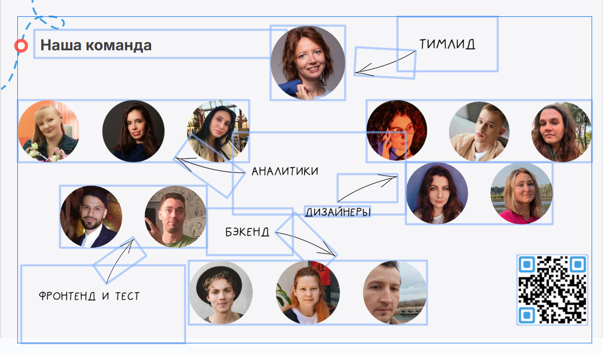

# Bus tours - Маркетплейс для бронирования автобусов

## О проекте

Bus tours - это маркетплейс, созданный для упрощения процесса поиска и бронирования автобусов для групповых поездок, таких как школьные экскурсии и туристические поездки. Наша цель - предоставить удобную платформу для пользователей и транспортных компаний, обеспечивая полный цикл услуг от бронирования до управления расписанием.
## Достижения

Проект был создан с нуля в рамках хакатона, который длился 1 месяц. Мы заняли 1 место среди 3 команд!

## Позиционирование

Мы предлагаем уникальное преимущество - организацию экскурсий «под ключ» с полным сопровождением, включая решение всех логистических и административных вопросов, что особенно важно для учителей и родителей.

## Достижения

Мы разработали проект в рамках хакатона, в котором участвовали 3 команды, и заняли 1 место!

## Технологии

Проект разработан с использованием следующих технологий:
- HTML
- SCSS
- React
- React Router
- Vite
- Swagger
- Postman

## Участники команды

- **Тимлид:** Наталия Шабалдина
- **Дизайнеры:**
  - Соболева Ирина
  - Григорец Александра
  - Кашканова Светлана
  - Кичигина Юлия
  - Суетин Артём
- **Аналитики:**
  - Каржова Светлана
  - Юрьева Маргарита
- **Маркетологи:**
  - Нефёдова Анжелика
- **Бэкенд разработчики:**
  - Нурутдинова Гульназ
  - Бауков Владимир
  - Смирнов Максим
- **Фронтенд разработчик:**
  - Мамедов Шухрат
- **Тестировщик:**
  - Огнёв Денис

***Задеплоенный проект можно увидеть по*** [ссылке](https://bus-tour.vercel.app/)
